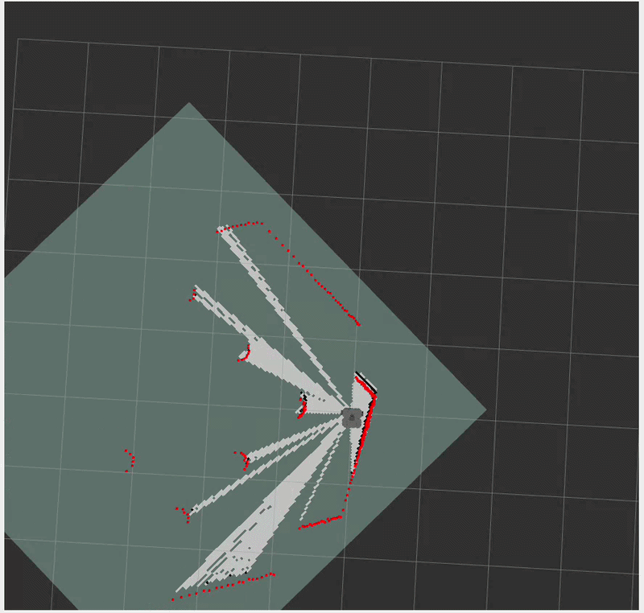

# ROS2 Autonomous Navigation# ROS2 Autonomous Navigation

## Introduction

This project focuses on developing a custom mapping system for autonomous robot navigation using ROS2, Gazebo Sim, and LiDAR-based environment perception.

The fundamental concept of mapping is based on LiDAR scan data. When a LiDAR beam travels and hits an object, all the space between the robot and the obstacle is considered free space, while the point where the beam stops represents the obstacle boundary.

Using this principle, real-world coordinate points are converted into a 2D occupancy grid map.

The mapping process works as follows:

- Free space is represented as white tiles
- Obstacle boundaries are represented as black tiles
- Real-world coordinates are transformed into grid coordinates
- The final output is a custom occupancy grid map generated from LiDAR data

This project aims to build the complete mapping pipeline from scratch instead of directly relying on existing SLAM packages.

---

## Technologies Used

- ROS2 Humble
- Ubuntu 22.04
- Gazebo Sim
- RViz2
- TurtleBot3 Waffle
- LiDAR Sensor
- Python / C++
- Occupancy Grid Mapping
- SLAM Concepts

---

## Mapping Comparison

### Custom Mapping System vs SLAM Toolbox

<table>
<tr>
<td align="center">

### Custom Mapping System

<!-- Add your GIF or video preview here -->

</td>

<td align="center">

### SLAM Toolbox Mapping

<!-- Add your SLAM Toolbox image here -->

</td>
</tr>
</table>

This section compares the results of the custom mapping implementation with the standard mapping generated using SLAM Toolbox.

The goal is to evaluate mapping accuracy, obstacle representation, and free-space detection while improving the custom implementation toward production-level performance.

---

## Current Status

The repository is still under active development.

The mapping system is functional, but further optimization is currently in progress, including:

- Improving map accuracy
- Better obstacle boundary handling
- Grid resolution optimization
- Noise reduction from LiDAR data
- Performance improvements for real-time execution

Future work will also include:

- Localization
- Path Planning
- Navigation Stack Integration
- Autonomous Goal Reaching using Nav2

---

## Author

Developed by Rishi Shendre  
Robotics | ROS2 | Autonomous Navigation